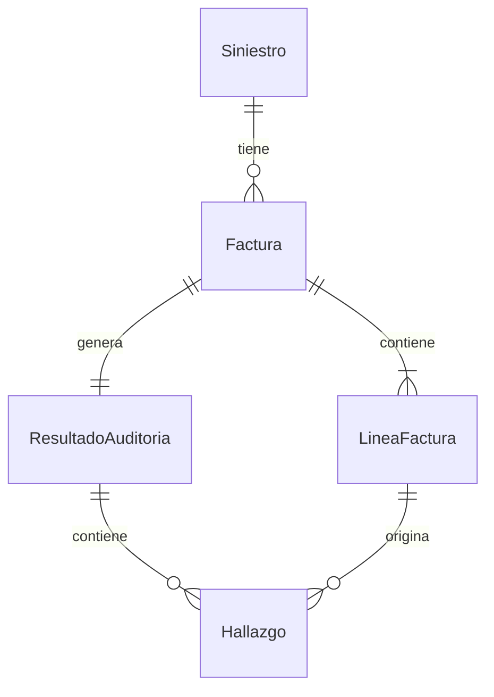

<!--
  - Lee el [architecture.md](/docs/architecture.md) para obtener información sobre la arquitectura y especificaciones técnicas del proyecto.
  - Lee el contenido de las specs en `.github/specs/` para obtener información sobre las entidades y relaciones.
-->

# Modelo de Datos para **Auditor Agéntico de Facturación de Siniestros**

Este documento describe el modelo de datos del sistema. Abarca las entidades principales, sus atributos y relaciones, y proporciona una representación visual mediante un diagrama Entidad-Relación.

Su objetivo es establecer un entendimiento común (lenguaje ubicuo) para la lógica de negocio y el diseño en Java.

## Convenciones Java

<!--
Seguir estrictamente estos estándares al implementar las entidades:
- Entidades JPA: clases anotadas con @Entity, @Table(name = "snake_case")
- IDs: Long autogenerado con @GeneratedValue(strategy = GenerationType.IDENTITY)
- DTOs: Java 21 Records — nunca clases con getters/setters
- Fechas: LocalDateTime — nunca Date ni Timestamp
- Enums: definidos como enum Java, persistidos como @Enumerated(EnumType.STRING)
- Atributos requeridos: @Column(nullable = false)
- Atributos únicos: @Column(unique = true)
- Nomenclatura: camelCase en Java, snake_case en base de datos
-->

## Entidades

### Siniestro

- Evento de daño reportado por el asegurado y asociado a una póliza.
- **Atributos**:
  - **id**: Long (required, unique) - Identificador único autogenerado
  - **numeroSiniestro**: String (required, unique) - Código de referencia del siniestro
  - **descripcionDanio**: String (required) - Descripción del daño reportado
  - **fechaOcurrencia**: LocalDateTime (required) - Fecha en que ocurrió el siniestro
  - **estado**: enum(ABIERTO, EN_AUDITORIA, CERRADO) (required) - Estado actual del caso
  - **createdAt**: LocalDateTime (required) - Fecha de registro en el sistema

---

### Factura

- Documento enviado por el taller con los insumos y honorarios cobrados a la aseguradora.
- **Atributos**:
  - **id**: Long (required, unique) - Identificador único autogenerado
  - **numeroFactura**: String (required, unique) - Número de la factura del taller
  - **nombreTaller**: String (required) - Nombre del taller emisor
  - **montoTotal**: BigDecimal (required) - Monto total facturado
  - **fechaEmision**: LocalDateTime (required) - Fecha de emisión de la factura
  - **archivoPdfPath**: String (required) - Ruta del PDF almacenado
  - **createdAt**: LocalDateTime (required) - Fecha de carga en el sistema

---

### LineaFactura

- Ítem individual dentro de una factura: un insumo o un honorario específico.
- **Atributos**:
  - **id**: Long (required, unique) - Identificador único autogenerado
  - **descripcion**: String (required) - Descripción del insumo o labor
  - **tipo**: enum(INSUMO, HONORARIO) (required) - Clasificación del concepto
  - **cantidad**: Integer (required) - Cantidad facturada
  - **precioUnitario**: BigDecimal (required) - Precio unitario cobrado
  - **precioTarifario**: BigDecimal (optional) - Precio según tarifario pactado, poblado por el RAG
  - **estado**: enum(APROBADO, DISCREPANCIA, DUPLICADO, NO_JUSTIFICADO) (required) - Resultado de la auditoría por línea

---

### ResultadoAuditoria

- Resultado consolidado del proceso de auditoría sobre una factura.
- **Atributos**:
  - **id**: Long (required, unique) - Identificador único autogenerado
  - **scoreRiesgo**: Integer (required) - Score calculado entre 0 y 100
  - **recomendacion**: enum(APROBAR, RECHAZAR, ESCALAR) (required) - Decisión del sistema
  - **resumenNarrativo**: String (required) - Análisis lógico generado por el LLM
  - **totalDiscrepancia**: BigDecimal (required) - Suma de deltas en valor absoluto
  - **createdAt**: LocalDateTime (required) - Fecha de generación del reporte

---

### Hallazgo

- Discrepancia, duplicado o ítem no justificado detectado durante la auditoría.
- **Atributos**:
  - **id**: Long (required, unique) - Identificador único autogenerado
  - **tipo**: enum(PRECIO_EXCEDIDO, DUPLICADO, NO_JUSTIFICADO) (required) - Categoría del hallazgo
  - **deltaAbsoluto**: BigDecimal (optional) - Diferencia en valor absoluto respecto al tarifario
  - **deltaPorcentual**: BigDecimal (optional) - Diferencia porcentual respecto al tarifario
  - **referenciasTarifario**: String (optional) - Referencia exacta del tarifario utilizada como sustento
  - **fragmentoSiniestro**: String (optional) - Fragmento del reporte de siniestro que justifica o refuta el cobro

---

## Relaciones

- Un siniestro puede tener una o varias facturas asociadas
- Una factura pertenece a un único siniestro
- Una factura contiene una o varias líneas de factura
- Una línea de factura pertenece a una única factura
- Una factura genera un único resultado de auditoría
- Un resultado de auditoría puede tener uno o varios hallazgos
- Un hallazgo está asociado a una única línea de factura

---

## Diagrama entidad-relación

